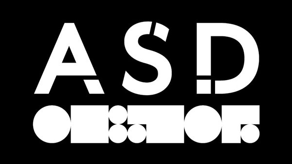
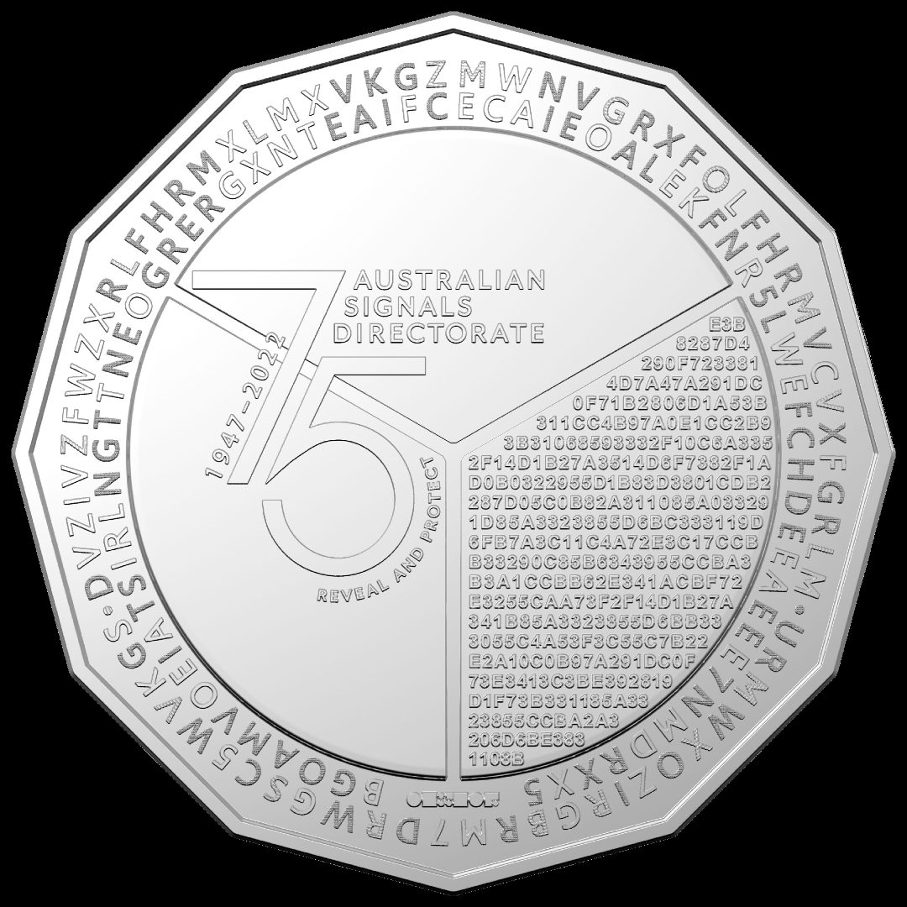
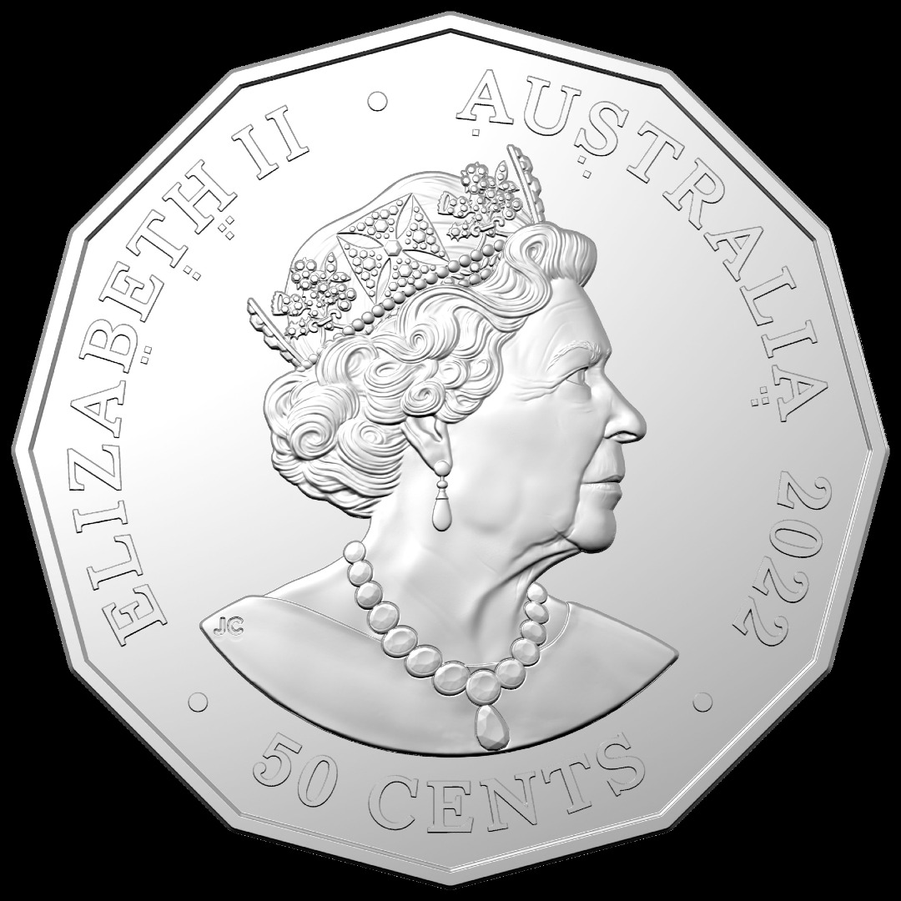
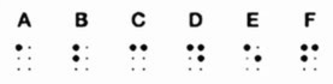
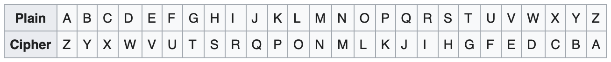
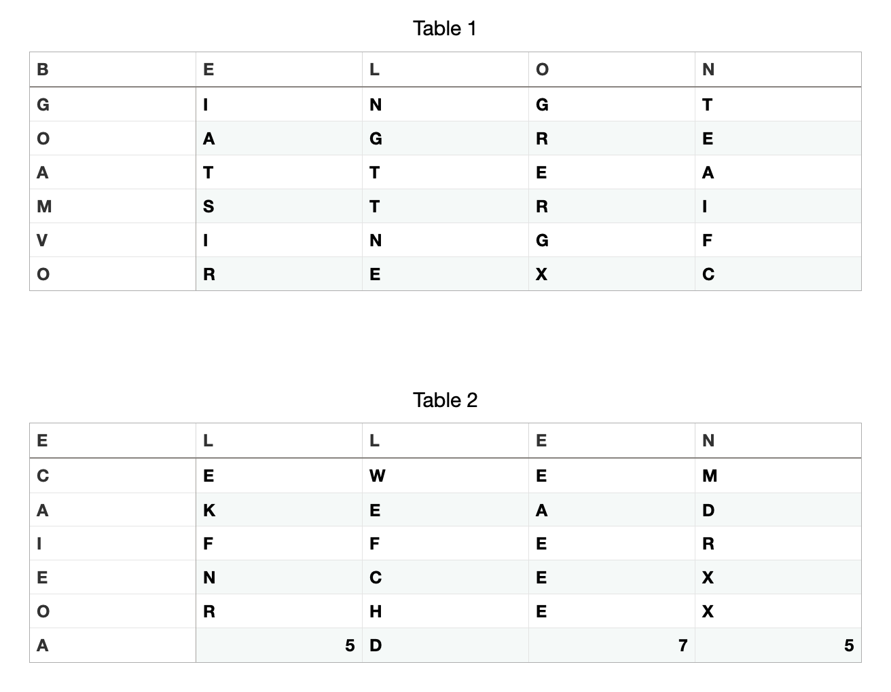
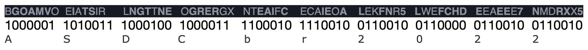
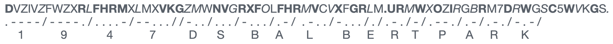

<div id="top"></div>

[![Contributors][contributors-shield]][contributors-url]
[![Forks][forks-shield]][forks-url]
[![Stargazers][stars-shield]][stars-url]
[![Issues][issues-shield]][issues-url]

<br />

<div align="center">
  <a href="https://github.com/coreyhellwege/asd-challenge">
    
  </a>

  <br />

  <h1 align="center">ASD Coin Challenge</h1>

  <br />

  <p align="center">
    These are my answers to the Australian Signals Directorate's 75th Anniversary Commemorative Coin Cipher Challenge. 
    <br />
    <br />
    <a href="https://github.com/coreyhellwege/asd-challenge/issues">Report Bug</a>
    ·
    <a href="https://github.com/coreyhellwege/asd-challenge/issues">Request Feature</a>
  </p>

  <br />

  
  
</div>

<br />

<details open>
  <summary>Table of Contents</summary>
  <ol>
    <li><a href="#challenge-1">Challenge 1</a></li>
    <li><a href="#challenge-2">Challenge 2</a></li>
    <li><a href="#challenge-3">Challenge 3</a></li>
    <li><a href="#challenge-4">Challenge 4</a></li>
    <li><a href="#bonus-challenge">Bonus Challenge</a></li>
  </ol>
</details>

<br />

## Challenge 1

On the heads side of the coin some of the letters making up 'Elizabeth II Australia' have small square symbols beneath them. My first thought was whether these symbols reference characters from the Braille alphabet.

After looking up the Braille alphabet I noticed the symbols represent the first six characters of the alphabet, A - F.



At first I tried to construct words with the letter combination but this didn't lead to anything meaningful.

I then noticed that if you reorder the six letters based on the order of the Braille characters below them it spells `ATBASH`.

This sounded familiar and after Googling the meaning I realised this most likely serves as a clue for the next challenge.

<p align="right"><a href="#top">back to top</a></p>

## Challenge 2

Using the clue from the first challenge, I translated the rings of characters on the tails side of the coin using the Atbash substitution cipher:



The inner ring didn't seem to translate to anything meaningful, but the outer ring yielded the following results:

### Top outer ring
```
DVZIVZFWZXRLFHRMXLMXVKGZMWNVGRXFOLFHRMVCVXFGRLM // original
WEAREAUDACIOUSINCONCEPTANDMETICULOUSINEXECUTION // translated
```

### Bottom outer ring
```
URMWXOZIRGBRM7DRWGSC5WVKGS // original
FINDCLARITYIN7WIDTHX5DEPTH // translated
```

<p align="right"><a href="#top">back to top</a></p>

## Challenge 3

Again, using the clue from the previous answer I worked out that the inner ring of characters was a Columnar Transposition Cipher and the clue informed the structure of the grid to use to decipher it.

### Inner ring

```
BGOAMVOEIATSIRLNGTTNEOGRERGXNTEAIFCECAIEOALEKFNR5LWEFCHDEEAEEE7NMDRXX5
```

The string is 70 characters in length. 7 x 5 = 35 so I realised 2 grids were required.

I originally created grids with 7 columns and 5 rows but this didn't appear to work.

I then created grids with 5 columns and 7 rows and this did the trick, revealing the following combined message:

```
BELONGINGTOAGREATTEAMSTRIVINGFOREXCELLENCEWEMAKEADIFFERENCEXORHEXA5D75
```



The last part of the message `XORHEXA5D75` didn't make any sense, so I thought it must serve as the next clue.

<p align="right"><a href="#top">back to top</a></p>

## Challenge 4

This challenge was my favourite. 

I started by copying out the large block of text contained within the inner-right segment on the tails side of the coin. RIP eyes..

I soon realised that this was a big hexadecimal string as it contains letters only ranging from A-F and numbers from 0-9 (as referenced in the previous clue as well). The clue also alludes to an XOR comparison (eXclusive OR) so that's where I figured the 'A5D75' comes in.

After a lot of messing around I wrote the following JavaScript function using the Node.js Buffer library to XOR the original string with the 'A5D75' key.

```javascript
const hex = 'E3B8287D4290F7233814D7A47A291DC0F71B2806D1A53B311CC4B97A0E1CC2B93B31068593332F10C6A3352F14D1B27A3514D6F7382F1AD0B0322955D1B83D3801CDB2287D05C0B82A311085A033291D85A3323855D6BC333119D6FB7A3C11C4A72E3C17CCBB33290C85B6343955CCBA3B3A1CCBB62E341ACBF72E3255CAA73F2F14D1B27A341B85A3323855D6BB333055C4A53F3C55C7B22E2A10C0B97A291DC0F73E3413C3BE392819D1F73B331185A3323855CCBA2A3206D6BE3831108B';
const key = 'A5D75';

/**
 * Use Node's Buffer library to transform the hex strings into two Buffer objects representing fixed-length sequences of bytes.
 * 
 * In order for the XOR comparison to work the key buffer needs to be the same length as the hex buffer. 
 * Use the Buffer.from() method to achieve this by specifying the hex buffer's byte length and filling it with the key. 
 * Note: The key must be repeated any number of times until its an even length, otherwise the buffer isnt calculated properly.
 * 
 * Then map over the hex buffer and do the Bitwise XOR comparison on each byte with the byte from the key buffer at the same index.
 * Convert the result to a string to reveal the message.
 * 
 * Buffer.from() takes a string to encode and the encoding charset.
 * Buffer.alloc() takes the Buffer size, fill and encoding charset.
 */
const xor = (hex, key) => {
    const hexBuf = Buffer.from(hex, 'hex'), keyBuf = Buffer.alloc(hexBuf.length, key.repeat(2), 'hex');
    return hexBuf.map((b, i) => b ^ keyBuf[i]).toString();
}

console.log(xor(hex, key));
```

Run the file in your terminal with node:
```sh
node xorHex
```

And the message is:

```
For 75 years the Australian Signals Directorate has brought together people with the skills, adaptability and imagination to operate in the slim area between the difficult and the impossible.
```

<p align="right"><a href="#top">back to top</a></p>

## Bonus Challenge

By this stage there didn't appear to be any further clues, but I knew there had to be another message related to the bold, unbold and semibold characters from the rings of text.

Unfortunately I had this challenge pretty much given away after I Googled the inner ring characters and saw a thread explaining that the inner ring references binary characters and the outer ring references Morse Code.

But anyway, for the inner ring I realised that the bold characters = 0 and the unbold characters = 1 and after using a Binary to text calculator the following message is revealed:



For the outer ring, the bold characters = dots, the unbold characters = dashes and the semibold characters = spaces (which I've represented with forward slashes).

Translating the corresponding Morse Code characters reveals the following message:



<p align="right"><a href="#top">back to top</a></p>

<!-- https://www.markdownguide.org/basic-syntax/#reference-style-links -->
[contributors-shield]: https://img.shields.io/github/contributors/coreyhellwege/asd-challenge.svg?style=for-the-badge
[contributors-url]: https://github.com/coreyhellwege/asd-challenge/graphs/contributors
[forks-shield]: https://img.shields.io/github/forks/coreyhellwege/asd-challenge.svg?style=for-the-badge
[forks-url]: https://github.com/coreyhellwege/asd-challenge/network/members
[stars-shield]: https://img.shields.io/github/stars/coreyhellwege/asd-challenge.svg?style=for-the-badge
[stars-url]: https://github.com/coreyhellwege/asd-challenge/stargazers
[issues-shield]: https://img.shields.io/github/issues/coreyhellwege/asd-challenge.svg?style=for-the-badge
[issues-url]: https://github.com/coreyhellwege/asd-challenge/issues